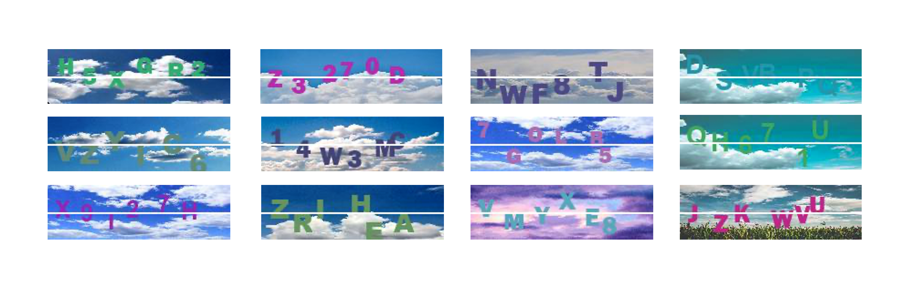
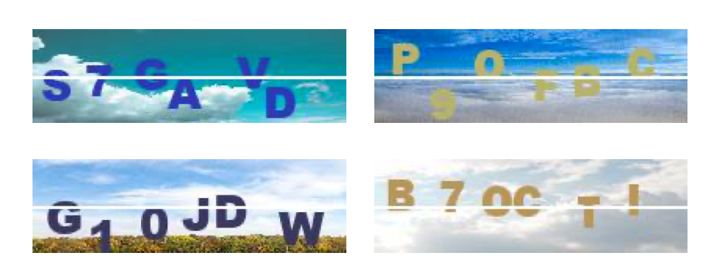
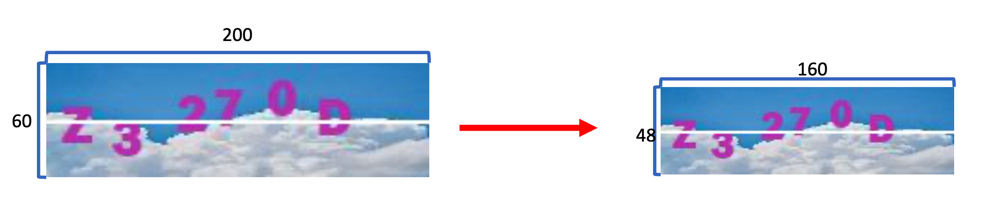
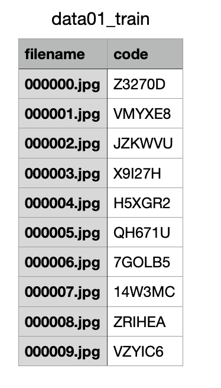
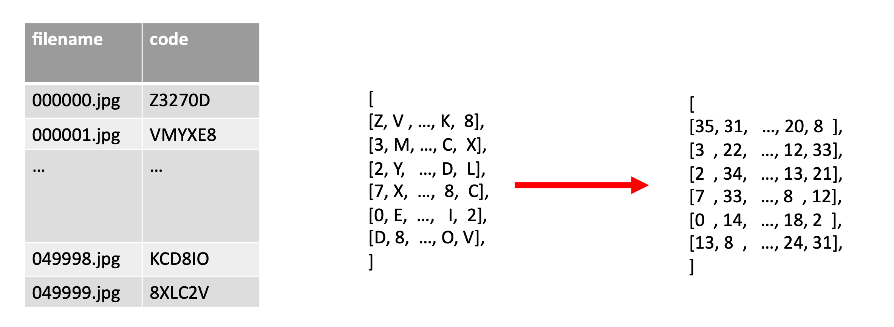
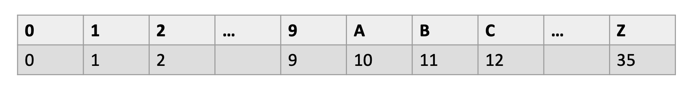
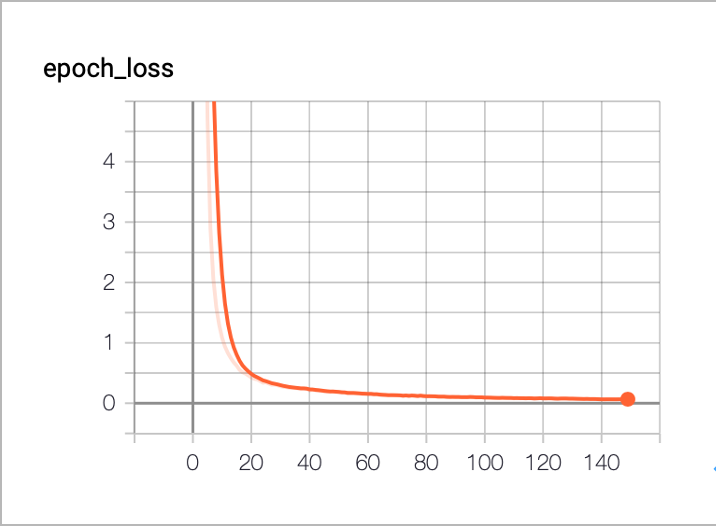

# ***Deep Learning for CAPTCHA Recognition***

## Summary

  CAPTCHA (Completely Automated Public Turing test to tell Computers and Humans Apart) is one of the challenge-response tests used in verification websites to determine whether the user is human or not.

  The project builds a Convolutional Neural Network (CNN) model to solve the recognition problem of CAPTCHA. Considering 6 alphanumeric digits, the accuracy is 99.7% and 99.4% in two training sets, which means the CNN model could fully fit the alphanumeric problem.

 

***

## Prerequisite

+ Python 3.7.5
+ Keras 2.3.1

***

## Build Setup

### *Run The System*

```cmd
$ python3 src/Main.py
```

***

## Key Point

### *Data Preprocessing*

#### Input Data

+ Description

  Each image in the training data has 200 * 60 pixels and represents 6 digit alphanumeric characters (0, 1, 2, ..., 9, A, B, C, ..., Z).

  

+ Preprocessing

  ```python
  def getRGBData(path):
        xData = []
        fileSet = sorted(glob(path+ "/*.jpg"))
        for file in fileSet:
            image = Image.open(file)
            image = image.resize((int(np.array(image).shape[1]*resizeRate),int(np.array(image).shape[0]*resizeRate)))
            xData.append(np.array(image))
        return np.array(xData)
  ```

  + This function converts JPG data in training set into *np.array* data structure.

  + To speed up training processing, each image is minimized by 80%.

    

#### Label Data

+ Description
  
  In the label data, the primary key is *filename*, and the attribute is *code*. In other words, the label of *filesname* is *code*.

  

+ Preprocessing

  ```python
  def getLableData(path):
    yLabel = [[] for digitIndex in range(digitNumber)]
    with open(path, newline='') as csvfile:
    reader = csv.DictReader(csvfile)
    count = 0
        for row in reader:
            for characterIndex in range(len(row['code'])):
                if ord(row['code'][characterIndex]) <= 57:
                    yLabel[characterIndex].append(ord(row['code'][characterIndex])-48)
                else:
                    yLabel[characterIndex].append(ord(row['code'][characterIndex])-65+10)
            count += 1
    return yLabel
  ```

  

  + This function maps alphanumeric data in CSV data (*path*) into numeric data according to the mapping table below.

  

#### Convolutional Neural Network (in Main.py)

+ Model Architecture

    ```python
    input_1 (InputLayer) (None, 48, 160, 3) 0 __________________________________________________________________________________________________ conv_1_1 (Conv2D) (None, 48, 160, 32) 896 input_1[0][0] __________________________________________________________________________________________________ conv_1_2 (Conv2D) (None, 46, 158, 32) 9248 conv_1_1[0][0] __________________________________________________________________________________________________ batch_normalization_1 (BatchNor (None, 46, 158, 32) 128 conv_1_2[0][0] __________________________________________________________________________________________________ max_pooling2d_1 (MaxPooling2D) (None, 23, 79, 32) 0 batch_normalization_1[0][0] __________________________________________________________________________________________________ dropout_1 (Dropout) (None, 23, 79, 32) 0 max_pooling2d_1[0][0] __________________________________________________________________________________________________ conv_2_1 (Conv2D) (None, 23, 79, 64) 18496 dropout_1[0][0] __________________________________________________________________________________________________ conv_2_2 (Conv2D) (None, 21, 77, 64) 36928 conv_2_1[0][0] __________________________________________________________________________________________________ batch_normalization_2 (BatchNor (None, 21, 77, 64) 256 conv_2_2[0][0] __________________________________________________________________________________________________ max_pooling2d_2 (MaxPooling2D) (None, 10, 38, 64) 0 batch_normalization_2[0][0] __________________________________________________________________________________________________ dropout_2 (Dropout) (None, 10, 38, 64) 0 max_pooling2d_2[0][0] __________________________________________________________________________________________________ conv_3_1 (Conv2D) (None, 10, 38, 128) 73856 dropout_2[0][0] __________________________________________________________________________________________________ conv_3_2 (Conv2D) (None, 8, 36, 128) 147584 conv_3_1[0][0] __________________________________________________________________________________________________ batch_normalization_3 (BatchNor (None, 8, 36, 128) 512 conv_3_2[0][0] __________________________________________________________________________________________________ max_pooling2d_3 (MaxPooling2D) (None, 4, 18, 128) 0 batch_normalization_3[0][0] __________________________________________________________________________________________________ dropout_3 (Dropout) (None, 4, 18, 128) 0 max_pooling2d_3[0][0] __________________________________________________________________________________________________ conv_4_1 (Conv2D) (None, 2, 16, 256) 295168 dropout_3[0][0] __________________________________________________________________________________________________ batch_normalization_4 (BatchNor (None, 2, 16, 256) 1024 conv_4_1[0][0] __________________________________________________________________________________________________ max_pooling2d_4 (MaxPooling2D) (None, 1, 8, 256) 0 batch_normalization_4[0][0] __________________________________________________________________________________________________ flatten_1 (Flatten) (None, 2048) 0 max_pooling2d_4[0][0] __________________________________________________________________________________________________ dropout_4 (Dropout) (None, 2048) 0 flatten_1[0][0] __________________________________________________________________________________________________
    digit1 (Dense) (None, 36) 73764 dropout_4[0][0] ___________________________________________________________________________________ digit2 (Dense) (None, 36) 73764 dropout_4[0][0] ___________________________________________________________________________________ digit3 (Dense) (None, 36) 73764 dropout_4[0][0] ___________________________________________________________________________________ digit4 (Dense) (None, 36) 73764 dropout_4[0][0] ___________________________________________________________________________________ digit5 (Dense) (None, 36) 73764 dropout_4[0][0] ___________________________________________________________________________________ digit6 (Dense) (None, 36) 73764 dropout_4[0][0]

    ```

  + CNN Model consists of *Dense*, *Dropout*, *Flatten*, *Conv2D*, *MaxPooling2D*, *BatchNormalization* Layers.

  + The output layer is comprised of 6 branches of *Dense* layers. Each branch handles the identification of each digit. Because each digit is processed into 36 digits by *One-Hot Encoding*, there are 36 *Dense* layers output in each branch of the output layer.

***

## Result

+ Result (Testing Set)
    | Data Set | Accuracy  | Training History |
    | :-------: | :--------: | :--------: |
    | data01 | 99.7% |  |
    | data02 | 99.4% |  |
